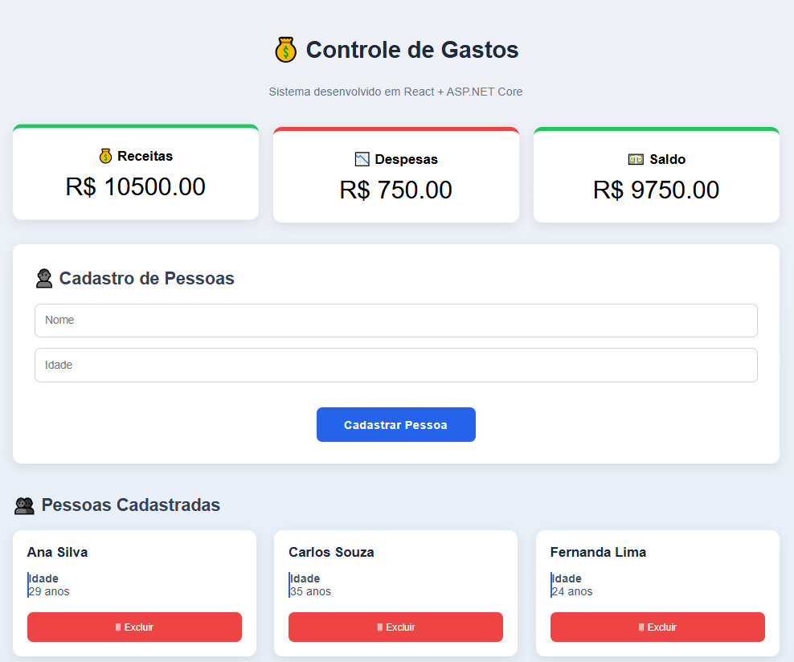
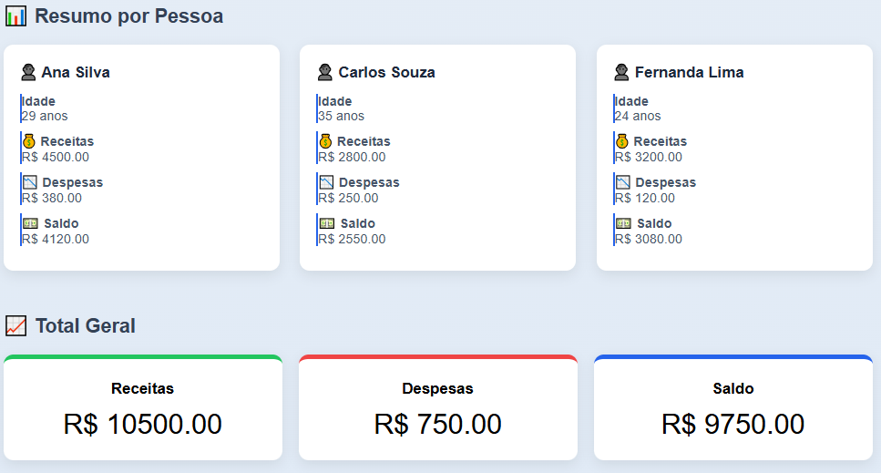
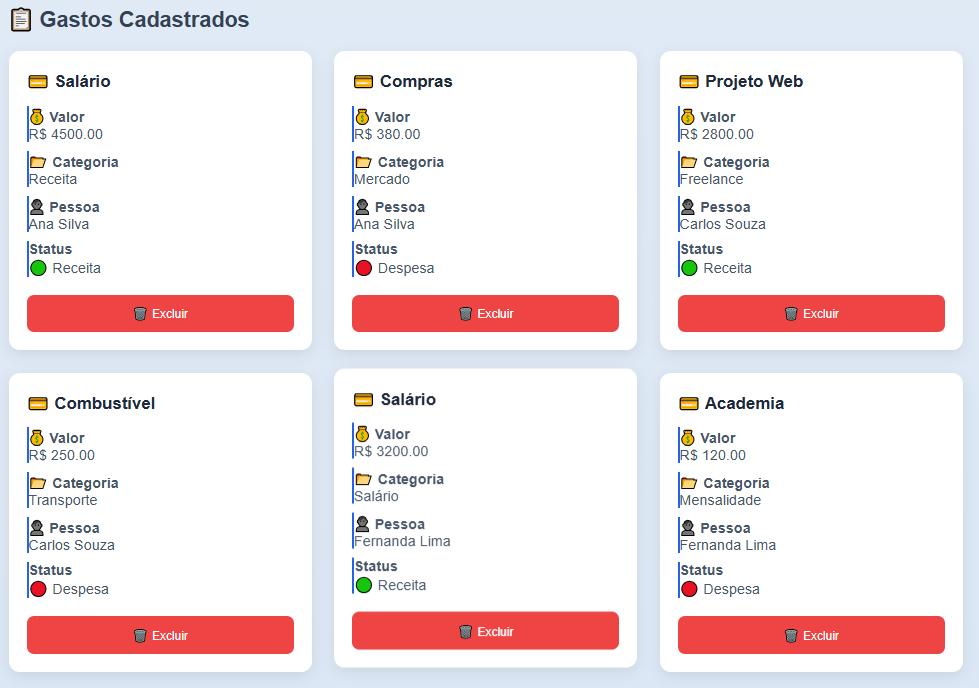

# 💰 Controle de Gastos

Sistema Full Stack desenvolvido utilizando **React**, **ASP.NET Core 8** e **SQLite**, com o objetivo de gerenciar receitas e despesas de diferentes pessoas.

O projeto foi desenvolvido como parte dos meus estudos em **Análise e Desenvolvimento de Sistemas**, aplicando conceitos de APIs REST, Entity Framework Core, banco de dados relacional, integração entre Front-end e Back-end e boas práticas de desenvolvimento.

---

## 📷 Demonstração

### Dashboard



Painel inicial com resumo financeiro, cadastro e gerenciamento de pessoas.

---

### Pessoas



Visualização do resumo financeiro individual de cada pessoa cadastrada.

---

### Gastos



Cadastro e gerenciamento de receitas e despesas vinculadas às pessoas.

--- 

# 🚀 Tecnologias utilizadas

## Front-end

- React
- Vite
- JavaScript
- CSS3
- Axios

## Back-end

- ASP.NET Core 8
- Entity Framework Core
- SQLite

## Ferramentas

- Git
- GitHub
- Visual Studio Code
- Swagger

---

# ✨ Funcionalidades

## Pessoas

- ✅ Cadastro de Pessoas
- ✅ Listagem de Pessoas
- ✅ Atualização de Pessoas
- ✅ Exclusão de Pessoas

## Gastos

- ✅ Cadastro de Gastos
- ✅ Listagem de Gastos
- ✅ Atualização de Gastos
- ✅ Exclusão de Gastos

## Dashboard

- ✅ Total de Receitas
- ✅ Total de Despesas
- ✅ Saldo Geral
- ✅ Totais por Pessoa

## Regras de negócio

- ✅ Menores de idade não podem cadastrar receitas.
- ✅ Uma pessoa deve existir antes de cadastrar um gasto.
- ✅ Exclusão em cascata entre Pessoa e Gastos.

---

# 📋 Requisitos atendidos

✔ CRUD completo de Pessoas

✔ CRUD completo de Gastos

✔ Relacionamento entre Pessoa e Gasto

✔ Persistência em SQLite

✔ Dashboard Financeiro

✔ Regra de negócio para menores de idade

✔ API REST

---

# 📂 Estrutura do Projeto

```
Controle-Gastos
│
├── backend
│   ├── Controllers
│   ├── Data
│   ├── Migrations
│   ├── Models
│   ├── Program.cs
│   └── backend.csproj
│
├── frontend
│   ├── src
│   │   ├── components
│   │   ├── services
│   │   ├── App.jsx
│   │   ├── App.css
│   │   └── main.jsx
│   │
│   ├── public
│   └── package.json
│
└── README.md
```

---

# ⚙️ Como executar o projeto

## 1️⃣ Clonar o repositório

```bash
git clone https://github.com/willianapv/controle-gastos.git
```

---

## 2️⃣ Executar o Back-end

```bash
cd backend

dotnet restore

dotnet ef database update

dotnet run
```

A API ficará disponível em:

```
http://localhost:5086
```

Swagger:

```
http://localhost:5086/swagger
```

---

## 3️⃣ Executar o Front-end

```bash
cd frontend

npm install

npm run dev
```

O Front-end ficará disponível em:

```
http://localhost:5173
```

---

# 📚 Aprendizados

Durante o desenvolvimento deste projeto foram aplicados conceitos como:

- Desenvolvimento de APIs REST
- Entity Framework Core
- Migrations
- SQLite
- Componentização em React
- Consumo de APIs utilizando Axios
- Integração entre Front-end e Back-end
- Git e GitHub
- Organização de projetos Full Stack

---

# 👨‍💻 Autor

## Willian Almeida

Estudante de Análise e Desenvolvimento de Sistemas.

### GitHub

https://github.com/willianapv

### LinkedIn

https://www.linkedin.com/in/willian-almeida-de-castro-34913b18